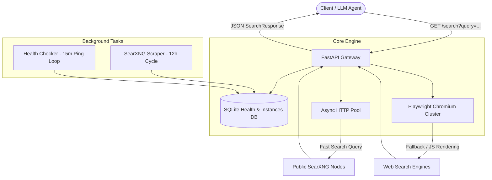

# 🌐 Free Browser Search API

[](https://opensource.org/licenses/MIT)
[](https://www.python.org/)
[](https://fastapi.tiangolo.com/)
[](https://playwright.dev/)

A high-performance, self-hosted, resilient web search aggregation and extraction gateway powered by public SearXNG instances, automated health monitoring, SQLite persistence, and Playwright browser fallback.

---

## ✨ Features

- **🚀 100% Free & Open-Source**: No paid API keys or external subscriptions required.
- **🔄 Auto Instance Discovery & Scraping**: Automatically fetches and maintains fresh SearXNG instances from [searx.space](https://searx.space).
- **💓 Self-Healing Health Checks**: Background worker continuously verifies instance availability and latency every 15 minutes, prioritizing the fastest and most responsive nodes.
- **🎭 Playwright Headless Fallback**: Automated headless browser scraping handles complex JavaScript rendering and bot protection seamlessly.
- **⚡ High Concurrency & Speed**: Built on **FastAPI** with `asyncio` connection pooling, semaphore control, and strict request deadlines (15s timeout).
- **🎨 Custom Dark-Themed Swagger Docs**: Sleek, modern Swagger UI available out-of-the-box at `/docs`.
- **📦 Structured Results**: Returns clean, normalized search responses containing page titles, URLs, snippet summaries, and extracted markdown context.

---

## 🏗️ Architecture Overview



---

## 🚀 Getting Started

### Prerequisites

- **Python**: `>= 3.10` and `< 3.13`
- **Poetry** (recommended) or **pip**

### 1. Clone the Repository

```bash
git clone https://github.com/EbxdMalix/Free-Browser-Search-API.git
cd Free-Browser-Search-API
```

### 2. Install Dependencies

Using Poetry:
```bash
poetry install
poetry run playwright install chromium
```

Or using `pip`:
```bash
pip install -r pyproject.toml  # or pip install fastapi uvicorn playwright beautifulsoup4 markdownify pydantic httpx
playwright install chromium
```

### 3. Run the Server

```bash
poetry run python main.py
```

The API gateway will start on `http://0.0.0.0:11236` (or `http://localhost:11236`).

---

## 📖 API Documentation

Interactive API documentation with a dark theme is accessible directly in your browser at:
👉 **`http://localhost:11236/docs`**

### Key Endpoints

#### 1. Search Query
`GET /search`

Parameters:
- `query` (string, required): The search terms.
- `max_results` (integer, optional, default: 10): Number of results to return (1-20).

**Example Request:**
```bash
curl -X GET "http://localhost:11236/search?query=latest+artificial+intelligence+news&max_results=5"
```

**Example Response:**
```json
{
  "query": "latest artificial intelligence news",
  "results": [
    {
      "title": "Artificial Intelligence News & Insights",
      "url": "https://example.com/ai-news",
      "snippet": "Latest breakthroughs in machine learning and AI technology...",
      "content": "Full markdown text extracted from the target webpage..."
    }
  ],
  "total_results": 5,
  "time_taken_ms": 1240
}
```

#### 2. Get Available Instances
`GET /get-instances`

Returns the current list of active and healthy SearXNG instances stored in the local SQLite database.

#### 3. Update Instances (Manual Trigger)
`GET /update-instances`

Triggers an on-demand scraper run against `searx.space` to refresh and populate new instances.

---

## 👤 About the Author

This project is created and maintained by:

- **Author**: **EbxdMalix**
- **GitHub**: [@EbxdMalix](https://github.com/EbxdMalix)
- **Repository**: [EbxdMalix/Free-Browser-Search-API](https://github.com/EbxdMalix/Free-Browser-Search-API)

Contributions, issues, feature requests, and pull requests are welcome!

---

## 📄 License

This project is open-source software licensed under the **[MIT License](LICENSE)**.
Feel free to use, modify, and distribute it in your personal and commercial projects.
